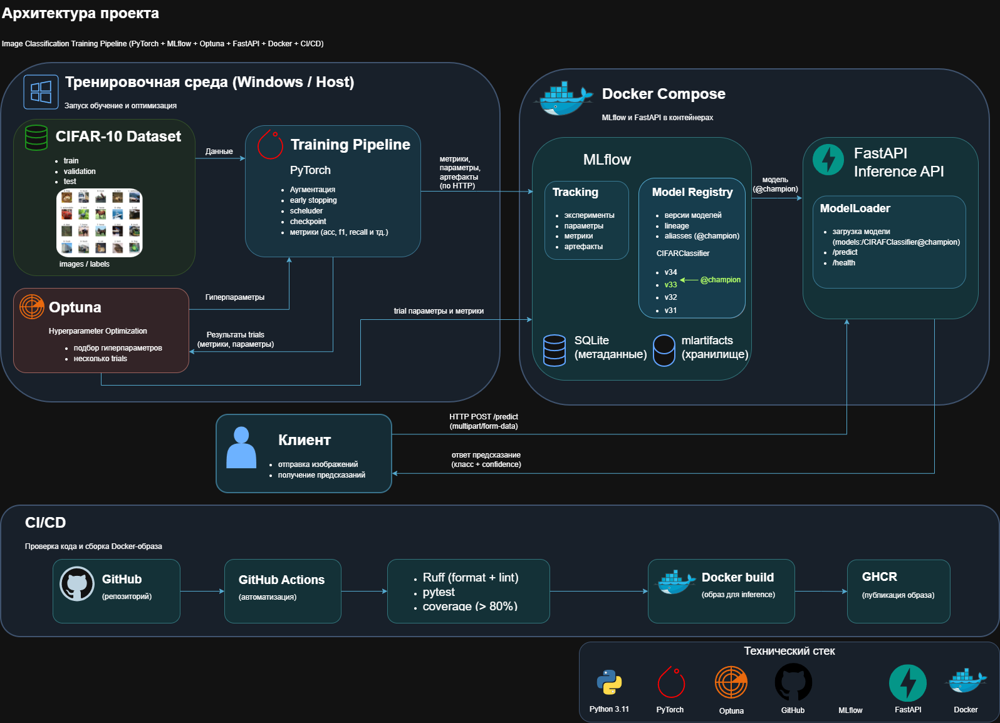
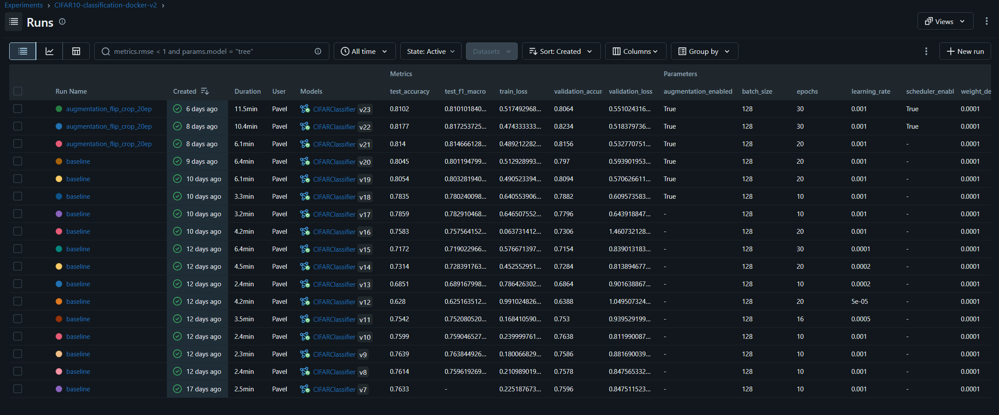
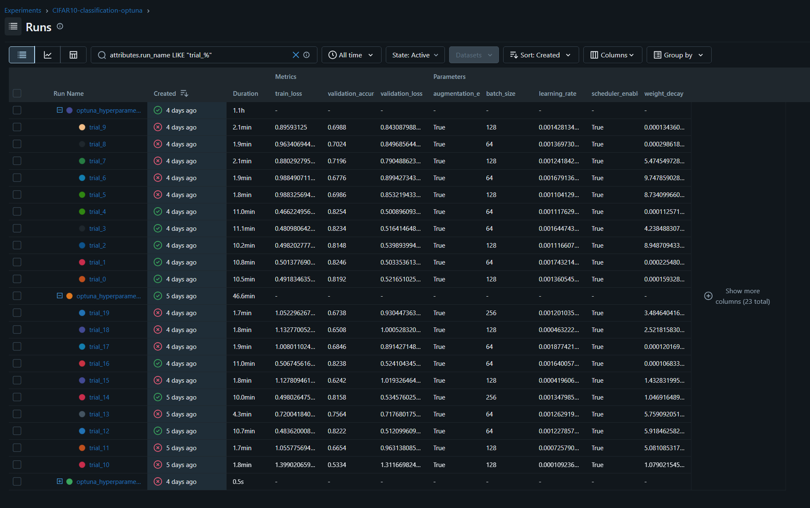
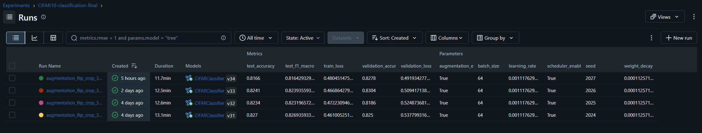
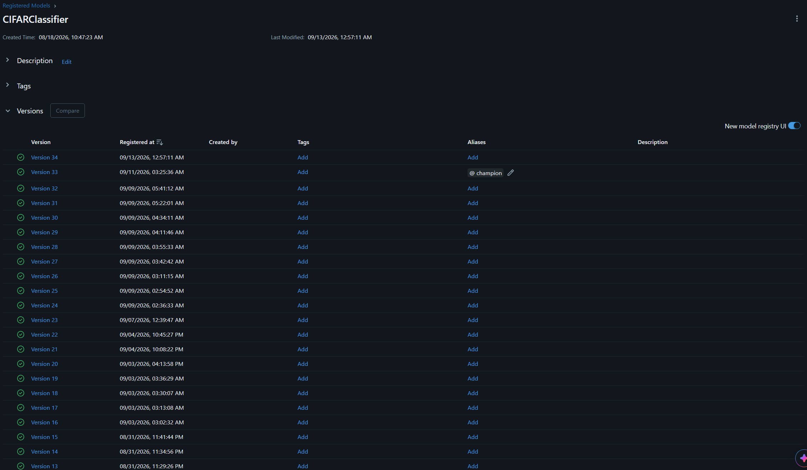

# Image Classification Training Pipeline

Учебный проект по построению полного ML-процесса для классификации изображений: от обучения модели и экспериментов до регистрации модели и её использования через API.

В проекте используются PyTorch, Optuna и MLflow. Для inference сделан отдельный сервис на FastAPI, который запускается в Docker. Проверка кода и тесты выполняются через GitHub Actions.

В качестве датасета используется CIFAR-10.

## Что здесь есть

Проект включает несколько отдельных частей, которые связаны между собой:

* обучение модели на PyTorch;
* train / validation / test разделение;
* аугментации изображений;
* Early Stopping и scheduler;
* сохранение лучшего checkpoint;
* логирование экспериментов в MLflow;
* подбор гиперпараметров через Optuna;
* MLflow Model Registry;
* выбор модели с alias `champion`;
* FastAPI для inference;
* Docker Compose;
* автоматические тесты;
* Ruff и pre-commit;
* GitHub Actions;
* публикация Docker-образа в GHCR.

Основная идея проекта — пройти не только этап обучения модели, но и остальные этапы, которые появляются вокруг неё при подготовке ML-сервиса.

## Архитектура



Исходник диаграммы: [`docs/architecture.drawio`](docs/architecture.drawio)

Обучение и Optuna запускаются на host-машине. MLflow и FastAPI работают в Docker Compose.

Training Pipeline отправляет в MLflow параметры, метрики и артефакты. Optuna управляет запусками обучения и использует validation metric для сравнения trials.

После обучения модель регистрируется в MLflow Model Registry. Для inference используется alias `@champion`, поэтому FastAPI не привязывается к конкретному номеру версии модели.

Клиент работает только с FastAPI. Изображение отправляется на `/predict`, после чего API возвращает результат классификации.

## Технологический стек

| Задача                 | Технология              |
| ---------------------- | ----------------------- |
| Язык                   | Python 3.11             |
| Обучение               | PyTorch                 |
| Датасет                | CIFAR-10                |
| Подбор гиперпараметров | Optuna                  |
| Tracking               | MLflow                  |
| Model Registry         | MLflow                  |
| API                    | FastAPI                 |
| Метрики                | scikit-learn            |
| Тестирование           | pytest                  |
| Форматирование и lint  | Ruff                    |
| Git hooks              | pre-commit              |
| Контейнеризация        | Docker / Docker Compose |
| CI/CD                  | GitHub Actions          |
| Container Registry     | GHCR                    |

## Структура проекта

Основные каталоги:

* `.github/` — GitHub Actions;
* `app/` — FastAPI-приложение;
* `configs/` — конфигурация обучения и inference;
* `samples/` — изображения для ручной проверки API;
* `scripts/` — запуск обучения, оптимизации и работы с Model Registry;
* `src/` — основная ML-логика;
* `tests/` — автоматические тесты.

Файлы в корне:

* `Dockerfile` — образ inference-сервиса;
* `docker-compose.yml` — MLflow и FastAPI;
* `check_alias.py` — проверка alias модели;
* `logging_config.py` — настройка логирования;
* `pyproject.toml` — настройки проекта и инструментов;
* `.pre-commit-config.yaml` — pre-commit hooks;
* `requirements.txt` — основные зависимости;
* `requirements-train.txt` — зависимости для обучения и Optuna;
* `requirements-dev.txt` — зависимости для разработки и тестов.

## Обучение модели

В основе проекта находится обычный training loop на PyTorch.

Для обучения используются train и validation выборки, а test используется отдельно для финальной оценки.

В конфигурации можно задавать batch size, learning rate, weight decay, количество эпох, число workers и устройство, на котором выполняется обучение.

Основная конфигурация находится в:

```text
configs/train.yaml
```

Запуск обучения:

```bash
python -m scripts.train
```

Во время обучения собираются training и validation metrics. Для каждого запуска создаётся MLflow run.

### Аугментации

В текущей конфигурации используются:

* horizontal flip;
* random crop;
* random rotation.

Например:

```yaml
augmentation:
  enabled: true
  horizontal_flip: true
  random_crop: true
  crop_padding: 4
  random_rotation: true
  rotation_degrees: 15
```

### Early Stopping

Early Stopping используется для остановки обучения, если validation metric перестаёт улучшаться.

```yaml
early_stopping:
  enabled: true
  patience: 5
```

При обучении сохраняется лучший checkpoint.

### Scheduler

Для изменения learning rate используется scheduler.

Текущая конфигурация:

```yaml
scheduler:
  enabled: true
  type: cosine
  min_learning_rate: 0.00001
```

### Метрики

Во время обучения отслеживаются:

* training loss;
* validation loss;
* validation accuracy.

После обучения дополнительно рассчитываются:

* test accuracy;
* precision;
* recall;
* F1.

## Подбор гиперпараметров

Для автоматического поиска параметров используется Optuna.

Запуск:

```bash
python -m scripts.optimize
```

Каждый trial запускает обычный training pipeline с новым набором параметров. После завершения обучения validation metric передаётся обратно Optuna.

Результаты trials также сохраняются в MLflow, поэтому параметры и результаты разных запусков можно сравнивать в одном месте.

Study Optuna хранится в SQLite.

## MLflow

MLflow в проекте используется для двух задач:

1. Tracking экспериментов.
2. Model Registry.

Для training runs сохраняются параметры, метрики, артефакты и обученная модель.

Отдельно логируются результаты Optuna.

В процессе разработки были выполнены несколько серий запусков:

* обычные training runs;
* эксперименты с подбором гиперпараметров;
* финальные запуски с разными seed.

### Основные эксперименты



### Optuna



### Финальные запуски



## Model Registry



После обучения модель регистрируется в MLflow Model Registry.

У одной модели может быть несколько версий:

```text
CIFARClassifier
v31
v32
v33
v34
```

Для inference используется alias:

```text
@champion
```

Сейчас FastAPI загружает:

```text
models:/CIFARClassifier@champion
```

Это позволяет менять используемую версию модели через MLflow, не меняя код inference-сервиса.

### Как выбирается champion

Выбор выполняется отдельным скриптом:

```bash
python -m scripts.register_best_model
```

Для сравнения используется `best_validation_accuracy`.

Скрипт находит лучший training run, определяет соответствующую версию модели и сравнивает её с текущей `champion`. Если кандидат имеет более высокий validation score, alias переносится на новую версию.

Test set в этом сравнении не используется.

## Результаты

На текущей версии проекта:

| Модель              | Best Validation Accuracy | Test Accuracy | Статус      |
| ------------------- | -----------------------: | ------------: | ----------- |
| CIFARClassifier v33 |                   0.8304 |        0.8241 | `@champion` |
| CIFARClassifier v34 |                   0.8278 |        0.8166 | candidate   |

Для `v33` test accuracy была отдельно проверена через загрузку модели из Registry с alias `champion`.

Это важно, поскольку последняя обученная модель не обязательно становится `champion`.

## Inference API

Для inference используется FastAPI.

Конфигурация сервиса находится в:

```text
configs/inference.yaml
```

### `/health`

Проверка состояния сервиса:

```text
GET /health
```

Endpoint возвращает информацию о состоянии API, загружена ли модель, имя модели, alias и устройство.

### `/predict`

Классификация изображения выполняется через:

```text
POST /predict
```

Изображение передаётся в формате `multipart/form-data`.

Пример:

```bash
curl -X POST "http://localhost:8000/predict" ^
  -F "file=@samples/example.png"
```

Конкретные поля ответа определяются схемой FastAPI.

## Samples

В `samples/` находятся готовые изображения, которые можно использовать для быстрой ручной проверки API.

Это удобнее, чем каждый раз извлекать изображения из CIFAR-10 отдельно.

## Установка

Клонирование репозитория:

```bash
git clone https://github.com/Whilifer/image-classification-training.git
cd image-classification-training
```

Создание виртуального окружения:

```powershell
python -m venv .venv
.venv\Scripts\Activate.ps1
```

Основные зависимости:

```bash
pip install -r requirements.txt
```

Зависимости для обучения и Optuna:

```bash
pip install -r requirements-train.txt
```

Зависимости для разработки и тестов:

```bash
pip install -r requirements-dev.txt
```

## Запуск MLflow

MLflow запускается через Docker Compose:

```bash
docker compose up -d mlflow
```

После запуска интерфейс доступен по адресу:

```text
http://127.0.0.1:5001
```

Training scripts, запущенные на host-машине, используют:

```text
http://127.0.0.1:5001
```

Для FastAPI внутри Docker Compose используется:

```text
http://mlflow:5000
```

Это связано с тем, что из контейнера MLflow доступен по имени compose-сервиса.

## Обучение

После запуска MLflow:

```bash
python -m scripts.train
```

Скрипт выполняет обучение, валидацию, сохранение лучшего checkpoint и регистрацию модели в MLflow.

## Оптимизация

Запуск Optuna:

```bash
python -m scripts.optimize
```

После этого результаты trials можно посмотреть в MLflow.

## Выбор champion

```bash
python -m scripts.register_best_model
```

После выполнения в Registry обновляется alias `@champion`, если найденная модель лучше текущей по validation metric.

## Оценка зарегистрированной модели

Для отдельной проверки текущей `champion`:

```bash
python -m scripts.evaluate_registered_model
```

В этом случае загружается именно:

```text
models:/CIFARClassifier@champion
```

а не последний локальный checkpoint.

Это позволяет отдельно проверить ту модель, которая используется inference-сервисом.

## Docker

Сборка и запуск:

```bash
docker compose up --build
```

После запуска:

```text
FastAPI → http://localhost:8000
MLflow  → http://localhost:5001
```

Обучение и Optuna через Docker Compose автоматически не запускаются. Они остаются отдельными командами, выполняемыми на host-машине.

## Тестирование

Для запуска тестов:

```bash
python -m pytest tests
```

Покрытие:

```bash
python -m pytest tests --cov=app --cov-report=term
```

В CI используется минимальный порог покрытия 80%.

Для проверки форматирования:

```bash
ruff format --check .
```

Для lint:

```bash
ruff check .
```

## CI/CD

GitHub Actions автоматически запускает проверки проекта.

Основные этапы:

1. установка зависимостей;
2. проверка форматирования Ruff;
3. запуск Ruff lint;
4. запуск pytest;
5. проверка coverage;
6. сборка Docker image.

При push в `main` после успешного прохождения тестов Docker image публикуется в GitHub Container Registry.

В CI используются Python 3.11 и тот же набор основных инструментов, что и локально.

## Воспроизводимость

Для воспроизводимости в проекте используются:

* seed;
* YAML-конфигурация;
* фиксированные версии ключевых зависимостей;
* MLflow для хранения параметров и результатов запусков;
* сохранение конфигурации вместе с экспериментами.

Финальные запуски проводились с различными seed, чтобы сравнить результаты между несколькими запусками обучения.

## Troubleshooting

### После изменения FastAPI ничего не поменялось

Если приложение запущено в Docker, после изменения кода нужно пересобрать image:

```bash
docker compose down
docker compose up --build
```

### Training script не подключается к MLflow

Проверь, что контейнер MLflow запущен:

```bash
docker compose ps
```

И что MLflow доступен по адресу:

```text
http://127.0.0.1:5001
```

### FastAPI не находит `champion`

Сначала проверь наличие зарегистрированной модели и alias.

При необходимости:

```bash
python -m scripts.register_best_model
```

После этого FastAPI должен загрузить:

```text
models:/CIFARClassifier@champion
```

### Docker не собирается

Сначала можно проверить сборку локально:

```bash
docker build -t image-classification-training-inference .
```

Если локальная сборка успешна, а CI падает, дальнейшую диагностику можно проводить по логам GitHub Actions.

## Возможные улучшения

В дальнейшем проект можно развивать в нескольких направлениях:

* deployment inference-сервиса;
* полноценный Continuous Deployment;
* мониторинг API;
* сбор production metrics;
* отслеживание data/model drift;
* автоматический retraining;
* GPU inference;
* более сложные модели;
* отдельная production-конфигурация MLflow.

## Заключение

Проект собран вокруг одного полного сценария: обучение модели, эксперименты с параметрами, сохранение результатов в MLflow, регистрация версий модели и её использование через API.

При этом обучение, Model Registry и inference разделены между собой, поэтому отдельные части системы можно изменять и запускать независимо.
